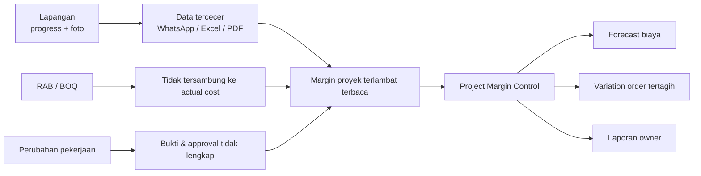
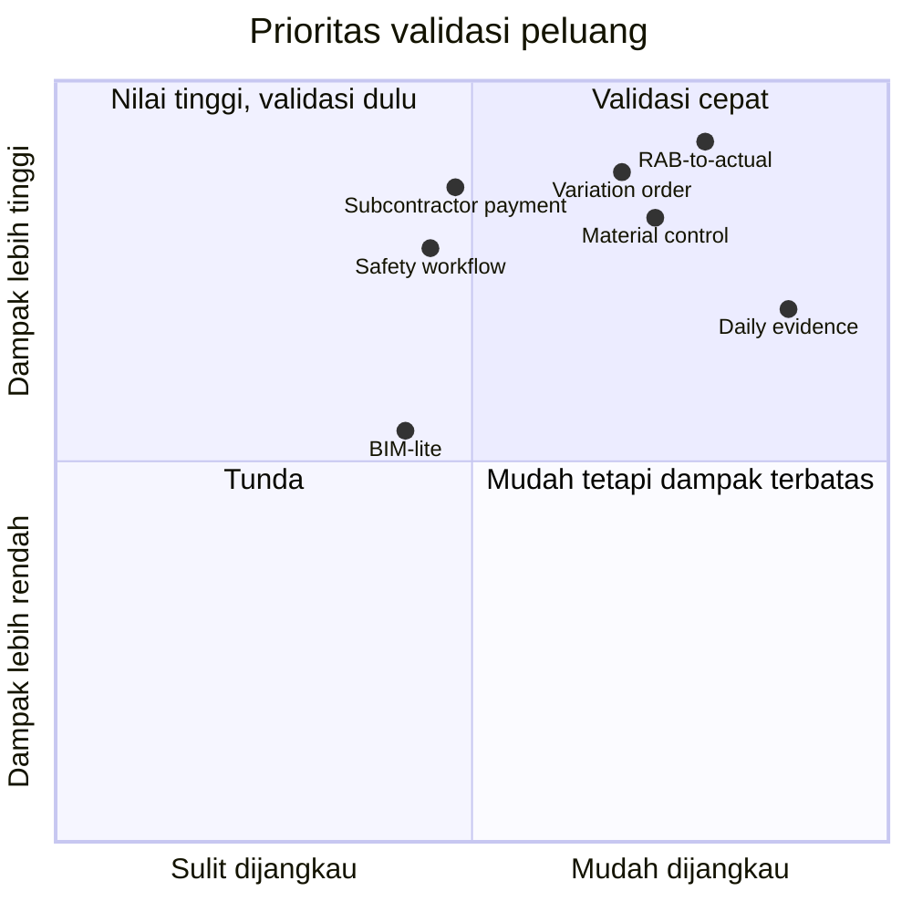
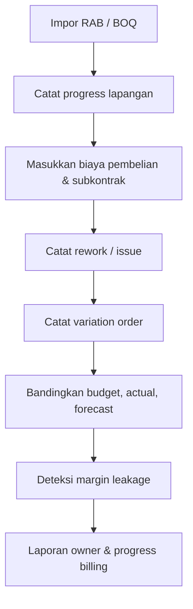

# Riset Celah Tools Industri Konstruksi Indonesia

> **Desk research untuk menemukan masalah konstruksi yang dapat dipermudah dengan tools digital.**
>
> **Hipotesis utama:** bangun *Project Margin Control* untuk kontraktor spesialis—hubungkan RAB, progress lapangan, biaya aktual, pekerjaan tambah, dan bukti penagihan sebelum margin proyek bocor.

## Baca cepat

| Temuan | Makna produk |
|---|---|
| Rework adalah faktor cost overrun yang disepakati owner dan kontraktor | Tangkap penyebab, bukti, dan biaya rework sedini mungkin |
| Perubahan pekerjaan sering tersebar di chat, foto, dan instruksi lisan | Buat *variation order* yang dapat ditelusuri dan ditagihkan |
| Progress lapangan belum tersambung ke biaya aktual | Tampilkan budget vs actual vs forecast per item pekerjaan |
| BIM penuh masih berat bagi kontraktor lokal | Mulai dari workflow ringan berbasis Excel, foto, dan PDF |

## Masalah inti dalam satu gambar

## Prioritas peluang

> **Cara membaca:** posisi diagram adalah prioritas hipotesis, bukan ukuran pasar. Validasi pertama sebaiknya menguji peluang yang dampaknya tinggi dan dapat dijangkau tanpa integrasi enterprise.

### Skor prioritas indikatif

Skala setiap dimensi: 1–5. Total bukan TAM/SAM/SOM dan harus diuji lewat pelanggan.

| Peringkat | Peluang | Pain | Frekuensi | Potensi bayar | Kemudahan MVP | Total |
|---:|---|---:|---:|---:|---:|---:|
| 1 | RAB-to-actual cost control | 5 | 5 | 5 | 4 | **23** |
| 1 | Daily site evidence | 4 | 5 | 4 | 5 | **23** |
| 3 | Variation order & claim evidence | 5 | 4 | 5 | 4 | **22** |
| 3 | Material request-to-delivery | 5 | 5 | 4 | 4 | **22** |
| 5 | Quality punchlist/NCR | 4 | 4 | 4 | 5 | **21** |
| 6 | Subcontractor progress/payment | 5 | 4 | 5 | 3 | **20** |
| 7 | Safety/near-miss workflow | 5 | 4 | 3 | 4 | **19** |
| 8 | Handover/warranty/defect | 3 | 3 | 3 | 5 | **18** |
| 9 | Drawing revision/BIM-lite | 4 | 3 | 3 | 3 | **16** |

## Alur produk yang disarankan

### MVP yang paling kecil tetapi bernilai

1. Impor RAB/BOQ dari Excel.
2. Catat progress per item pekerjaan.
3. Catat biaya aktual dan bukti foto/dokumen.
4. Catat perubahan pekerjaan beserta status approval.
5. Tampilkan budget vs actual vs forecast.
6. Ekspor laporan Excel/PDF.

**Jangan mulai dari:** BIM 3D penuh, marketplace material, AI estimator, atau ERP konstruksi lengkap.

## Langkah berikutnya

Validasi sebelum membangun aplikasi penuh:

- wawancarai 5 kontraktor spesialis, 3 kontraktor umum, 3 project manager/site engineer, 3 QS/estimator, 2 admin finance, dan 2 subkontraktor;
- minta melihat RAB, laporan harian, chat perubahan pekerjaan, dan format progress claim;
- jalankan *concierge MVP* berbasis spreadsheet pada satu proyek;
- ukur cost leakage yang ditemukan, pekerjaan tambah yang berhasil ditagihkan, dan waktu laporan yang dihemat;
- lanjut membangun software hanya jika ada minimal 3 pilot dan minimal 2 pelanggan bersedia membayar.

## Dashboard HTML

Buka versi visual interaktif: **[Dashboard Riset Konstruksi](https://pippoauliaa-dev.github.io/riset-tools-konstruksi/)**

Dashboard menyediakan KPI ringkas, ranking peluang, matriks dampak vs reach, workflow produk, filter kategori, mode gelap, tooltip, dan tabel detail.

## Isi repository

- [Dashboard HTML](index.html)
- [Laporan riset lengkap](docs/riset-celah-tools-konstruksi-indonesia.md)
- [Sumber dan keterbatasan riset](docs/riset-celah-tools-konstruksi-indonesia.md#keterbatasan-riset)

## Status riset

- **Jenis:** desk research
- **Fokus:** Indonesia, kontraktor dan subkontraktor kecil-menengah
- **Status:** hipotesis peluang; belum divalidasi melalui customer interview
- **Tanggal:** 18 September 2026

Skor dan diagram di README adalah ringkasan visual agar pembaca dapat memahami arah riset dalam satu menit. Detail bukti, sumber akademik, asumsi, dan keterbatasan ada di [laporan lengkap](docs/riset-celah-tools-konstruksi-indonesia.md).
